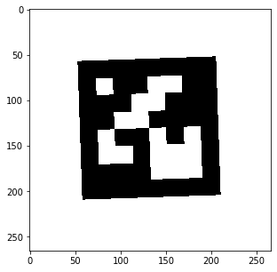

# Marker Detection
This is to introduce my solution to one of the assignments; the algorithm for marker detection. 

---
## Introduction
I've conducted 2D-images marker detection with [ArUco markers](https://docs.opencv.org/trunk/d5/dae/tutorial_aruco_detection.html). Since the detector is made up of a convolutional layer and pooling layer, I strongly recommend using GPU to save your time. The detection process can be divided into 3 steps; frame detection, extraction, and comparison. The sample of the images is shown below.


---
## Procedure
As I said, the process segments into frame detection, extraction, and comparison.
 
### frame detection
Overall, this process is to eliminate most of the pixels which are not the representative to be the center position of the markers. The samples of the marker that I use have a black frame in common as you can see the previous example, so, at first, the model detects the marker's frame position, and also the rotation and the size of the markers by using various size and rotation of frame activation filters, which are constructed by convolutional layer. The samples of the filter are illustrated below. 


After this process, you can get the score of activation in every location with regard to various sizes and rotations. When you compute the maximum value referring to various sizes and rotations, you can get the scores in matrix form as shown below.


Even though Numerous pixels are activated around the expected area, we're only interested in the maximum activation in a certain local space. Therefore I also conducted the computation that takes a maximum in local area and inputs 0 into non-maximum area. The result becomes like the image below.


Lastly, get the location that has a value above the threshold and it is considered as one of the representatives.

### extraction
In this process, as the name indicates, the candidates are extracted and converted into the original size and rotation based on the score in the previous process. Since we have an access to the detected size and rotation, we can easily extract it and convert it into the desired one. the extraction and the conversion are conducted and you can get the images below. The conversion process includes rotation and pooling computation. 



### Comparison
This is simplest process. The processed image is compared with all examples and is classified as the most similar example. The final result will be:


---
## Installation of some apps
The basic pip requirements are noted in `data/requrements.txt`.

---
## How to run the code
It contains 2 functions; `generate_representation.py` and `detection.py`. The former indicates the generation of the target image and the other is to detect the marker. You're able to control the minimum and maximum size of the marker, the maximum rotation, and the level of noise in both generation and detection process. Please visit the function to further information.  You can run the function with the codes below.
- generation
```bash
python generate_representation.py "./data/representation.png"
```
the argument specifies the path of the target representation.
- detection
```bash
python detection.py "./data/representation.png" "./data/"
```
the arguments indicate the path of the target image and the directory path which will include the result, respectively.


## Contact
Feel free to contact me if you have any questions(<s-inoue-tgz@eagle.sophia.ac.jp>).

